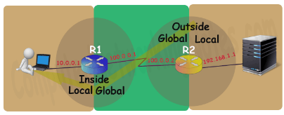
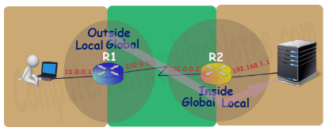

# **4.0 IP Services**

## **4.1 Configure and Verify inside source NAT using static and pools**

- NAT (Network Address Translation) is a process that modifies the IP addresses in packets as they pass through a router, allowing multiple devices on a private network to share a single public IP address or a pool of public IPs. It enhances security by masking internal IP addresses and conserves the limited pool of IPv4 addresses.

- NAT Terminology
  - Inside Local IP Address
    - Before translation source IP address located inside the local network.
  - Inside Global IP Address
    - After translation source IP address located outside the local network.
  - Outside Global IP Address
    - Before translation destination IP address located outside the remote network.
  - Outside Local IP Address
    - After translation destination IP address located inside the remote network.

- Inside Local -> Inside Global -> Outside Global -> Outside Local

- Example on R1 Routing table
  - 
- Same Example on R2 Routing Table
  - 

- There are three types of NAT, Static NAT, Dynamic NAT and PAT, These types of define how inside local IP address will be mapped with inside global IP address.

- Static NAT
  - In this type, one would manually map each inside local IP address with inside global IP address. Since this type uses one to one mapping we need exactly same number of IP address on both sides.
- Dynamic NAT
  - In this type, one would create a pool of inside global IP addresses and let the NAT device to map inside local IP address with the available inside global IP address from the pool automatically.
- PAT
  - In this type a single inside global IP address is mapped with multiple inside local IP addresses using the source port address. This is also knows as PAT (Port Address Translation) or NAT over load.

- Static NAT configuration
  - `enable` 
  - `configure terminal`
  - `ip nat inside source static (inside-local-ip) (inside-global-ip)`
    - inside-local-ip: Private IP of the internal device (e.g., 192.168.1.10).
    - inside-global-ip: Public IP to which the private IP is mapped (e.g., 203.0.113.10).
  - -
  - `interface (inside-interface)`
  - `ip nat inside`
  - –
  - `interface (outside-interface)`
  - `i`p nat outside`

- NAT Pools Configuration
  - `ip nat pool (pool-name) (start-public-ip) (end-public-ip) netmask (subnet-mask)`
    - pool-name: Name of the NAT pool (e.g., PublicPool).
    - start-public-ip and end-public-ip: Range of public IPs (e.g., 203.0.113.10 203.0.113.20).
    - netmask: Subnet mask for the public IPs (e.g., 255.255.255.0).
  - `access-list (acl-number) permit ip (source-network) (wildcard-mask) any`
  - `ip nat inside source list (acl-number) pool (pool-name)`
  - –
  - `interface (inside-interface)`
  - `ip nat inside`
  - –
  - `interface (outside-interface)`
  - `ip nat outside`

- Verification Commands
  - `show ip nat translations`
  - `show ip nat statistics`
  - `debug ip nat`

## **4.2 Configure and verify NTP operating in a client and server mode**

- Network Time Protocol (NTP) is used to synchronize the clocks of network devices to a centralized time source, ensuring accurate timekeeping across devices.
  - Server Mode: The device provides time synchronization to other devices
  - Client Mode: The device synchronizes its clock with an NTP server
- NTP Server Configuration
  - `clock timezone EST -5`
  - `clock set 12:30:00 15 June 2024`
  - `ntp master 1`
- NTP Client Configuration
  - `ntp server (server ip)`
- Verification commands
  - `show ntp status`
  - `show ntp associations`

## **4.3 Explain the role of DHCP and DNS within the network**

- DHCP ensures devices receive IP addresses and other network configurations automatically.
- DNS simplifies network navigation by resolving domain names to IP addresses, enabling user-friendly access to services.

|**Protocol**|**DHCP**|**DNS**|
| :- | :- | :- |
|**Function**|Assigns IP addresses dynamically.|Resolves domain names to IP addresses.|
|**Scope**|Local area network (LAN).||

||
| :- |

||||
| :- | :- | :- |

|Global (internet and local networks).|
| :- |

||||
| :- | :- | :- |
|**Usage**|Automates network configuration.|Simplifies access to resources.|
|**Key Devices**|DHCP Server, DHCP Client.|DNS Server, DNS Client.|

## **4.4 Explain the function of SNMP in network operations** 

Simple Network Management Protocol

- SNMP is a protocol used to monitor, manage, and configure network devices such as routers, switches, servers, and other IP-enabled devices within a network.
- It enables administrators to collect performance data, detect faults, and adjust configurations remotely.

Functions of SNMP in Network Operations

- Network Monitoring
  - SNMP collects real-time performance data from devices
- Fault Detections
  - Devices send traps (alerts) to the SNMP manager when faults or specific conditions occur
- Configurations Management
  - SNMP can modify configurations on devices remotely using SET commands
- Performance Analysis
  - Historical SNMP data can help analyze network performance trends and predict future issues.
- Centralized Management
  - SNMP enables a centralized monitoring system (SNMP Manager) to interact with distributed network devices.

SNMP Components

- SNMP Manager
  - The central system that monitors and controls SNMP-enabled devices.
- SNMP Agent
  - Software running on network devices (e.g., routers, switches, servers) that collect and send information to the SNMP manager.
- Management Information Base
  - A database of objects managed by the SNMP agent (e.g., CPU load, memory usage).
- SNMP Traps
  - Notifications sent from agents to managers for specific events or issues

Key SNMP Commands

- GET : requests data from managed device
- GETNEXT : requests the next piece of data
- SET : modifies a value on the managed device
- TRAP : sends an alert to the SNMP manager

Example Use Case

- A network admin uses an SNMP monitoring tool like SolarWinds to:
  - Monitor bandwidth usage on all switches
  - Receive traps when a critical interface goes down
  - Check CPU utilization on routers to troubleshoot performance issues

## **4.5 Describe the use of syslog features including facilities and levels**

- Syslog (System Logging Protocol) is a standard protocol used for sending log messages from network devices (e.g., routers, switches, servers) to a centralized log server (Syslog Server).
- It helps network administrators monitor, troubleshoot, and audit network events.
- Syslog Facilities
  - 0 : Kernal messages
  - 1 : User-level messages
  - 4 : Authorization (security) messages
  - 5 : Syslog messages
  - 6 : Line printer subsystem
  - 10 : Security/authorization messages
  - 16-23 : Local use (local0-local7)

- Syslog Severity Levels
  - `0 : Emergency`
  - `1 : Alert`
  - `2 : Critical`
  - `3 : Error`
  - `4 : Warning`
  - `5 : Notice`
  - `6 : Informational`
  - `7 : Debug`

- Summary
  - Syslog provides centralized logging for network devices.
  - It uses facilities to categorize log messages and severity levels to prioritize their importance.
  - Administrators rely on Syslog to monitor network events, troubleshoot issues, and maintain security.

## **4.6 Configure and verify DHCP client and relay**

- To configure a router or device as a DHCP client on an interface:
  - `interface gigbitEthernet 0/1`
  - `ip address dhcp`
  - `no shutdown`

- Verfication
  - `show ip interface brief`

- In cases where the DHCP server is not on the same subnet as the DHCP clients, you need a DHCP relay agent to forward DHCP requests to the server

- Interface configuration (on the router acting as a relay)
  - `interface gigabitEthernet 0/1`
  - `ip helper-address 192.168.1.100`
  - `no shutdown`

- Verification commands
  - `show running-config interface gigabitEthernet 0/1`
  - `debug ip dhcp server packet` (verify relay agent forward requests)
  - `show ip dhcp binding` (check client ip assignments)

## **4.7 Explain the forwarding per-hop behavior (PHB) for QoS, such as classification, marking, queuing, congestion, policing, and shaping**

- Quality of Service (QoS) is a set of mechanisms used to prioritize network traffic, ensuring optimal performance for critical applications and minimizing issues like delay, jitter, and packet loss. Per-Hop Behavior (PHB) refers to how packets are handled and forwarded at each network device (e.g., routers and switches) along their path.

- Classification
  - Definition: Classifying traffic into different categories based on attributes such as IP address, protocol, port number, or application.
  - Purpose: Enables the network to identify and differentiate traffic types for further QoS treatment.
  - Example: Voice, video, and data traffic are classified into separate classes.

- Marking
  - Definition: Adding a QoS tag or value to packets to indicate their priority level.
  - Mechanism:
    - Layer 2: IEEE 802.1Q (CoS - Class of Service)
    - Layer 3: DSCP (Differentiated Services Code Point) in the IP header.
  - Purpose: Ensures downstream devices can recognize and prioritize the traffic based on the marking.
  - Example: Voice packets are marked with a high DSCP value like EF (Expedited Forwarding).

- Queuing
  - Definition: The process of placing packets into different queues for transmission based on their priority.
  - Purpose: Ensures that higher-priority traffic is forwarded before lower-priority traffic.
  - Types of Queuing:
    - Priority Queuing (PQ): Strict priority for critical traffic.
    - Weighted Fair Queuing (WFQ): Distributes bandwidth fairly across flows.
    - Class-Based Weighted Fair Queuing (CBWFQ): Customizes queue behavior per class.
    - Low Latency Queuing (LLQ): Adds strict priority queuing for delay-sensitive traffic like voice.

- Congestion Management
  - Definition: Mechanisms to manage traffic when the network experiences congestion.
  - Example: Traffic is queued based on priority, ensuring critical packets are sent first while others wait.

- Congestion Avoidance
  - Definition: Proactively dropping low-priority packets to avoid congestion before buffers overflow.
  - Mechanism:
  - Random Early Detection (RED): Randomly drops packets before queues are full.
  - Weighted RED (WRED): Applies RED with priority weights for different traffic types.

- Policing
  - Definition: Enforces a traffic rate limit by dropping or remarking packets that exceed the specified bandwidth.
  - Purpose: Controls the traffic rate at the network edge to prevent over-utilization.
  - Behavior:
    - Traffic exceeding the limit is dropped (hard policing).
    - Traffic may be remarked to a lower QoS level.

- Shaping
  - Definition: Smooths traffic flow by buffering excess traffic and sending it at a defined rate.
  - Purpose: Prevents bursts of traffic from overwhelming the network.
  - Behavior: Unlike policing, shaping delays packets instead of dropping them.

## **4.8 Configure network devices for remote access using SSH**

- Set the Hostname
  - `hostname R1`

- Set the Domain Name
  - `ip domain-name example.com`

- Generate RSA Encryption Keys
  - `crypto key generate rsa`
  - ‘`1024`’ key size is recommended for security

- Create a Local User for SSH Authentication
  - `username admin privilege 15 secret Cisco123`

- Enable SSH Version 2
  - `ip ssh version 2`

- Enable SSH on VTY Lines
  - `line vty 0 4`
  - `transport input ssh`
  - `login local`
  - `exit`

- Verify SSH Configuration
  - `show ip ssh`

- Test SSH from another device
  - `ssh admin@(ip-address)`

- Show SSH Sessions on Device
  - `show ssh`

## **4.9 Describe the capabilities and functions of TFTP/FTP in the network**

- TFTP (Trivial File Transfer Protocol)
- Capabilities:
  - Used for basic file transfer in a network
  - Operates over UDP port 69, which makes it faster but less reliable than FTP
  - Commonly used to transfer device configurations, IOS images, or small files
- Functions:
  - Simple and lightweight file transfer without authentication
  - Limited error-checking; ideal for local transfers (e.g., network boot or recovery)
  - Used in environments with low overhead (e.g., Cisco router booting via TFTP).

- FTP (File Transfer Protocol)
- Capabilities:
  - A full-featured protocol for transferring files.
  - Operates over TCP ports 20 (data) and 21 (control), providing reliable file transfers.
  - Supports authentication (username/password) and encryption (FTP Secure - FTPS).
- Functions:
  - Used for transferring large files securely and reliably.
  - Supports file upload/download, directory navigation, and file manipulation.
  - FTP servers can store device backups, logs, and network configurations.
  - Commonly used for off-site backups and centralized file storage.

|**Feature**|**TFTP**|**FTP**|
| :- | :- | :- |
|**Protocol**|UDP (Port 69)|TCP (Ports 20 & 21)|
|**Authentication**|No|Yes (username/password)|
|**Reliability**|Low (no error checking)|High (error checking & retransmit)|
|**Use Case**|Small/local file transfers|Large/secure transfers|
|**Encryption**|None|Supports FTPS (Secure FTP)|
|**Speed**|Faster (no overhead)|Slower (due to reliability features)|

