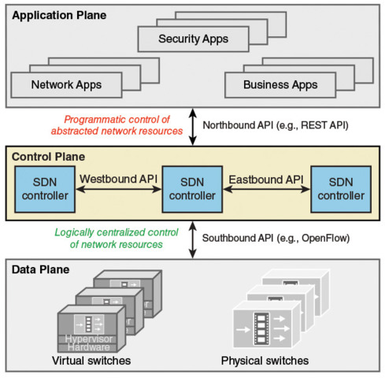

# **6.0 Automation and Programmability**

## **6.1 Explain how automation impacts network management**

Network automation significantly improves efficiency, consistency, and scalability in modern network environments. **Below are the key impacts**:

- **Simplifies Configuration Management**
  - Automation tools like Ansible, Cisco DNA Center, or Python scripts streamline the configuration process, reducing manual effort and errors.
  - Bulk configuration changes can be applied across multiple devices simultaneously.
- **Enhances Consistency and Standardization**
  - Ensures all network devices follow standardized configurations and policies, eliminating misconfigurations and reducing downtime.
- **Accelerates Deployment**
  - Automated provisioning allows for rapid deployment of devices and services, speeding up project timelines and network expansions.
- **Improves Network Monitoring and Troubleshooting**
  - Automation tools can proactively monitor networks for performance issues or outages and automatically resolve them using pre-defined workflows.
  - Examples: SNMP-based automation, syslog analysis, and auto-remediation scripts.
- **Enables Scalability**
  - Automation supports seamless growth by efficiently managing large-scale networks with minimal manual intervention.
  - Example: Managing 1,000 devices is as straightforward as managing 10 devices using scripts or templates.
- **Increases Security**
  - Automation helps maintain compliance by enforcing security policies across all devices and detecting configuration drift.
  - Example: Automated patch management and vulnerability scans.
- **Enables Intent-Based Networking (IBN)**
  - Automation allows for intent-based networking, where the network dynamically adjusts to meet business policies and user needs.
- **Reduces Operational Costs**
  - Minimizes manual labor and repetitive tasks, freeing IT staff to focus on strategic projects.
- **Provides Real-Time Insights**
  - Automation collects and analyzes data to provide actionable insights into network performance, enabling data-driven decisions.

## **6.2 Compare traditional networks with controller-based networking**

- **Traditional networks**, also known as standalone or distributed networks, are network architectures in which individual network devices, such as switches and routers, are managed independently. Each device is responsible for performing specific functions, such as forwarding traffic, making routing decisions, and providing network security.

- **Controller-based networking**, on the other hand, is an architecture in which a central controller is used to manage multiple network devices, such as switches and routers. The controller acts as a single point of management for the entire network, providing a unified view of the network and enabling centralized control and configuration of network devices.

The **main differences** between traditional networks and controller-based networks include:

- **Management**
  - Traditional network : each network device is managed independently
  - Controller-based network : all network devices are managed centrally through the controller
- **Scalability**
  - Traditional network : can be challenging to scale, as the number of network devices increases and the complexity of the network grows
  - Controller-based network : scalability is easier, as the controller provides a centralized management interface that can manage a large number of network devices
- **Agility**
  - Traditional network : can be slow to respond to changing network conditions, as each device must be configured independently
  - Controller-based network : changes can be made quickly and efficiently through the central controller
- **Network visibility**
  - Traditional network : it can be difficult to get a complete view of the network, as information is spread across multiple devices
  - Controller-based network : the controller provides a unified view of the network, enabling network administrators to quickly identify and resolve issues.


## **6.3 Describe controller-based, software defined architecture (overlay, underlay, and fabric)**

**Controller-Based Architecture** 
  - refers to a network design in which a central controller manages multiple network devices, such as switches and routers, to provide a unified view of the network and centralized control. The controller acts as a single point of management for the entire network, enabling network administrators to make changes and manage network devices more efficiently.

**Software-Defined Architecture**
  - refers to a network design that separates the control plane (the logic and decision-making functions) from the data plane (the forwarding of data packets). This separation enables network administrators to manage and configure the network through software, rather than manual configuration of individual network devices.

**Overlay Network**
  - Plane: Primarily operates in the data plane but is controlled and managed through the control plane.
  - Definition: A logical network that sits on top of an underlay network. It abstracts the physical infrastructure and provides virtualized connectivity between endpoints.
  - Purpose: Enables features like:
    - Segmentation (e.g., VLANs, VXLANs).
    - Tunneling (e.g., GRE, IPSec, or MPLS VPN).
    - Easier management of traffic flows, as policies can be enforced on the logical layer.
  - Example: SD-WAN tunnels between branches, VXLANs in a data center.

**Underlay Architecture**
  - Plane: Functions primarily in the data plane.
  - Definition: The physical infrastructure and routing mechanisms used to transport traffic (e.g., routers, switches, physical links).
  - Purpose: Provides the actual connectivity (IP routing, switching) and ensures reliable data delivery for overlay networks.
  - Example: MPLS, leased lines, or traditional WAN connections.

**Fabric Architecture**
  - Plane: Spans both the control plane and data plane.
  - Definition: A term used for the holistic combination of overlay and underlay networks, often seen in modern SDN architectures.
  - Purpose: Represents the entire networking system, where policies, management, and automation occur.
  - Control Plane Role: The SDN controller programs the fabric.
  - Data Plane Role: Handles actual data packet forwarding.
  - Example: Cisco ACI fabric, where the underlay consists of physical hardware, and the overlay is virtualized using VXLAN.



Ciscos **Three Planes of Networking** (SDN):

**Management / Application Plane:**
  - Handles administrative tasks like configuring, monitoring, and managing network devices.
  - Examples: SSH, Telnet, SNMP, HTTP/HTTPS.
  - Focus: Device-level management (e.g., configuring interfaces, monitoring logs).

**Control Plane:**
  - Handles decision-making for traffic flows. It manages routing, switching, and forwarding decisions.
  - Examples: Routing protocols (e.g., OSPF, BGP), spanning tree protocol (STP), SD-WAN controllers.
  - Focus: Traffic path selection and policy enforcement.

**Data Plane** / Forwarding Plane / Infrastructure Layer
  - Handles the actual forwarding of data packets through the device based on control plane decisions.
  - Examples: Packet forwarding, encapsulation/decapsulation.
  - Focus: Moving data packets through the network.

#### 6\.3.a Separation of control plane and data plane

The separation of the control plane and data plane refers to the division of network functions into two distinct and separate components. The control plane is responsible for the logic and decision-making functions of the network, such as routing, forwarding, and management. The data plane is responsible for forwarding data packets based on the instructions from the control plane

- The separation of the control plane and data plane has several advantages, including:

- **Scalability**
  - By separating the control and data planes, the network can be designed to handle increased traffic loads and grow in complexity without impacting performance.
- **Resilience**
  - If a problem occurs in the data plane, the control plane can continue to operate, ensuring that the network remains operational and minimizing downtime.
- **Flexibility**
  - By separating the control and data planes, network administrators can make changes to the network configuration without affecting the performance of data forwarding.
- **Programmability**
  - The separation of the control and data planes enables network administrators to manage the network through software, enabling the use of automation and scripting to configure and manage the network.

#### 6\.3.b Northbound and Southbound APIs

Northbound and Southbound APIs are key components of Software-Defined Networking (SDN) architecture, enabling communication between the SDN controller, applications, and underlying devices in the data plane:

**Visual Representation:**
  - [ User/Application ]  <---- **NBI** ---> [ SDN Controller ] < ---- **SBI** ----> [ Devices ]

1. **Northbound APIs (NBI)**
  - Purpose
    - Connect the SDN controller to applications in the application plane, such as network management systems and APIs.
    - Allow administrators to manage and configure network policies via the SDN controller.
  - Characteristics
    - Enables communication through web interfaces or RESTful APIs.
    - Abstracts the complexity of network operations, providing a simplified view for higher-level systems.
  - Examples
    - OSGI (Open Services Gateway Initiative): A modular platform for Java-based APIs.
    - REST (Representational State Transfer): A popular web-based API standard.

1. **Southbound APIs (SBI)**
  - Purpose
    - Connect the SDN controller to network devices like switches and routers in the data plane.
    - Facilitate communication and control between the controller (control plane) and devices (data plane).
  - Characteristics
    - Use protocols to manage and program the underlying devices.
    - Ensure the SDN controller can collect device information and push configurations dynamically.
  - Examples
    - NETCONF (Network Configuration Protocol): For device configuration and management.
    - OpenFlow: A widely used protocol to control forwarding tables in network devices.
    - OpFlex: A declarative policy model protocol for network configuration.
    - OnePK (Cisco’s One Platform Kit): A set of APIs for Cisco devices.

## **6.4 Explain AI (generative and predictive) and machine learning in network operations**

- **Generative AI** 
  - Focuses on creating new content or generating new data based on patterns and rules obtained from current data.

- **Predictive AI**
  - On the other hand, seeks to generate predictions or projections based on previous data and trends.

- **Machine learning** 
  - Concentrates on developing algorithms and models to gain insight from data and enhance performance.

- **Network Automation**
  - Focuses on using AI to automate network configuration, management, and troubleshooting tasks, reducing manual intervention and increasing efficiency.

- **Anomaly Detection**
  - Employs machine learning (ML) techniques to identify unusual patterns or potential security threats in network traffic, enhancing security and minimizing risks.

- **Performance Optimization**
  - Leverages AI to optimize network performance by predicting traffic patterns and dynamically adjusting resources to meet demand.


## **6.5 Describe characteristics of REST-based APIs (authentication types, CRUD, HTTP verbs, and data encoding)**

REST-based APIs (Representational State Transfer) have specific characteristics that make them widely used for web services. Here's a breakdown of the key aspects:

1. **Authentication Types**
  - REST APIs use various authentication mechanisms to secure endpoints and validate users:
    - Basic Authentication:
      - Encodes username and password in Base64, sent via the Authorization header.
    - Bearer Token Authentication: 
      - Uses tokens (e.g., OAuth 2.0 tokens) for authorization, included in the Authorization header as Bearer.
    - API Keys: 
      - Unique keys provided to clients to access APIs, usually passed in headers or query parameters.
    - OAuth 2.0: 
      - A widely used protocol for secure access, involving access tokens, refresh tokens, and scopes.
    - JWT (JSON Web Token): 
      - A compact, self-contained token used for authentication and data exchange.

1. **CRUD Operations**
  - REST APIs align with CRUD (Create, Read, Update, Delete) operations for data management.
  - Each operation maps to an HTTP verb:
    - Create → POST: Add new resources.
    - Read → GET: Retrieve data.
    - Update → PUT/PATCH: Modify existing resources:
      - PUT: Updates the entire resource.
      - PATCH: Updates part of the resource.
    - Delete → DELETE: Removes resources.

1. **HTTP Verbs**
  - The HTTP verbs define the intent of API requests:
    - GET: Retrieve information from the server without modifying it.
    - POST: Submit new data or create a resource.
    - PUT: Replace an existing resource or create it if it doesn’t exist.
    - PATCH: Partially update an existing resource.
    - DELETE: Remove a resource.
    - OPTIONS: Fetch supported HTTP methods for a resource.
    - HEAD: Retrieve headers of a resource without the body.

1. **Data Encoding**
  - REST APIs support various formats for sending and receiving data:
    - JSON (JavaScript Object Notation): The most commonly used format due to its simplicity and compatibility.
    - XML (Extensible Markup Language): Used when more complex data structures or schemas are needed.
    - Form Data: Encoded as key-value pairs (e.g., application/x-www-form-urlencoded or multipart/form-data for file uploads).
    - Plain Text: Simple text-based data.
  - Additionally, APIs specify content types in the Content-Type and Accept headers to ensure proper data encoding/decoding.

## **6.6 Recognize the capabilities of configuration management mechanisms, such as Ansible and Terraform**

Configuration management tools like Ansible and Terraform enable automated and consistent deployment, configuration, and management of infrastructure and applications. Here’s a breakdown of their capabilities:

1. **Ansible**
  - Ansible is an agentless, declarative configuration management tool focused on automating infrastructure provisioning, application deployment, and system configurations. Key capabilities include: 
    - Agentless Architecture:
      - Ansible operates over SSH (Linux) or WinRM (Windows) without requiring agent software on target systems.
    - Declarative Configuration Management:
      - Ensures the desired state of the system is described in YAML-based playbooks.
    - Idempotence:
      - Repeated executions of a playbook yield the same result without unintended changes.
    - Task Automation:
      - Automates repetitive tasks like software installation, user creation, and system updates.
    - Application Deployment:
      - Streamlines the deployment of multi-tier applications across multiple environments.
    - Infrastructure Provisioning:
      - Can provision virtual machines, containers, cloud resources, etc.
    - Inventory Management:
      - Dynamically manages groups of hosts, enabling fine-grained control.
    - Cross-Platform Support:
      - Supports Linux, Windows, cloud environments (AWS, Azure, Google Cloud), and container orchestration platforms like Kubernetes.

1. **Terraform**
  - Terraform is an open-source Infrastructure as Code (IaC) tool designed for creating, managing, and provisioning infrastructure across various providers (cloud or on-premises). Key capabilities include:
    - Infrastructure as Code (IaC):
      - Uses declarative configuration files (written in HashiCorp Configuration Language, HCL) to define and manage infrastructure.
    - Multi-Cloud Support:
      - Supports AWS, Azure, GCP, and many other providers, enabling consistent infrastructure provisioning across platforms.
    - Provisioning and Orchestration:
      - Automates provisioning of resources like virtual machines, networks, databases, and load balancers.
    - State Management:
      - Maintains the state of the infrastructure in state files, allowing tracking of changes and dependency management.
    - Immutability:
      - Encourages immutable infrastructure, where changes result in recreating resources rather than modifying them in place.
    - Plan and Apply Workflow:
      - terraform plan: Previews changes before applying them.
      - terraform apply: Applies the changes described in configuration files.
    - Modular Infrastructure:
      - Supports reusable modules for consistent configurations across environments.
    - Drift Detection:
      - Detects and reconciles differences between the actual state and the declared configuration.

**Comparison of Ansible and Terraform**

|**Feature**|**Ansible**|**Terraform**|
| :- | :- | :- |
|**Primary Use Case**|Configuration management and task automation|Infrastructure provisioning and orchestration|
|**Execution Model**|Push-based (agentless, via SSH/WinRM)|Declarative and state-based|
|**Language**|YAML||

||
| :- |

||||
| :- | :- | :- |

|HCL (HashiCorp Configuration Language)|
| :- |

||||
| :- | :- | :- |
|**Cloud Support**|||

||
| :- |

||||
| :- | :- | :- |

|Supported|
| :- |

|||Extensive multi-cloud support|
| :- | :- | :- |
|**Idempotence**|Ensured|Ensured|
|**Resource State Management**|No built-in state management|Tracks state in files|
|**Learning Curve**|Easier to learn for beginners|Slightly steeper, requires understanding of state management|

**Summary**
  - Ansible excels at configuring systems and automating tasks, making it ideal for application deployments, configuration changes, and environment management.
  - Terraform specializes in provisioning and managing infrastructure, particularly for cloud-based environments, with a focus on IaC and scalability.
- Both tools can complement each other in DevOps workflows. For example, Terraform can provision infrastructure, and Ansible can handle post-provisioning configurations.


## **6.7 Recognize components of JSON-encoded data**

- There are **two categories** of **JSON data types**, primitive data types and structured data types

**Primitive Data Types**
  - String: 
    - A sequence of characters enclosed in double quotes (e.g., "Hello").
  - Number: 
    - Represents numeric values, including integers and decimals (e.g., 42 or 3.14). 
  - Boolean
    - Represents a logical value, either true or false.
  - Null
    - Represents an empty or undefined value (e.g., null).

**Structure Data Types**
  - Object 
    - A collection of key-value pairs enclosed in curly braces (e.g., { "name": "John", "age": 30 }).
  - Array
    - An ordered list of values enclosed in square brackets (e.g., [1, 2, 3, 4]).

**Example:**
  ```
    {

    "stringType": "Hello, World!",

    "numberType": 42,

    "booleanType": true,

    "nullType": null,

    "objectType": {

      "key": "value"

    },

    "arrayType": [1, 2, 3, 4]

    }
  ```
**Explanation:**

  - "stringType": A string value.
  - "numberType": A numeric value.
  - "booleanType": A boolean value (true).
  - "nullType": A null value.
  - "objectType": An object (key-value pairs).
  - "arrayType": An array of numbers.

